# FoxFund - Budget Tracker

A professional full-stack budget tracking application built with TypeScript that helps users manage expenses, track budgets, and achieve savings goals.

## 🚀 Live Demo

[**View Live Application**](https://foxfund.vercel.app)

**Demo Account:**
- Email: `demo@foxfund.com`
- Password: `demo123`

## 📋 Project Overview

FoxFund is a comprehensive budget tracking application that helps users take control of their finances by tracking income, expenses, budgets, and savings goals. The app features a beautiful fox-themed design with both light and dark modes.

## 🛠 Tech Stack

**Frontend:**
- Next.js 15 with TypeScript
- TailwindCSS with custom fox theme
- React Context for state management
- Recharts for data visualization
- Lucide React for icons

**Backend:**
- Next.js API Routes with TypeScript
- PostgreSQL with Prisma ORM
- NextAuth.js for authentication
- Node.js runtime

**External Services:**
- Neon for PostgreSQL database
- Vercel for deployment

## ✨ Features

- **User Authentication** - Secure login and registration with NextAuth
- **Transaction Management** - Add, edit, delete income and expenses
- **Category System** - Custom spending categories with color coding
- **Budget Tracking** - Set monthly budgets with progress visualization
- **Financial Dashboard** - Income vs expenses summary with interactive charts
- **Advanced Filtering** - Date range, category, and text search
- **CSV Import/Export** - Bulk transaction management
- **Savings Goals** - Set and track monthly savings targets
- **Shared Budgets** - Collaborate on budgets with other users
- **Real-time Notifications** - In-app alerts for budget alerts and goal achievements
- **Responsive Design** - Works perfectly on desktop and mobile devices
- **Dark/Light Mode** - User preference support

## 📸 Screenshots

### Authentication
| Login Page | Registration Page |
|------------|-------------|
|  | 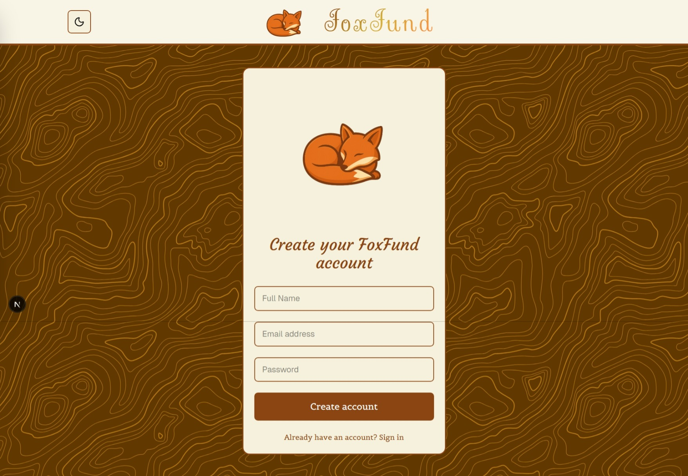 |

### Dashboard
| Desktop Dashboard | Mobile Dashboard | Dark Mode |
|------------------|------------------|-----------|
| 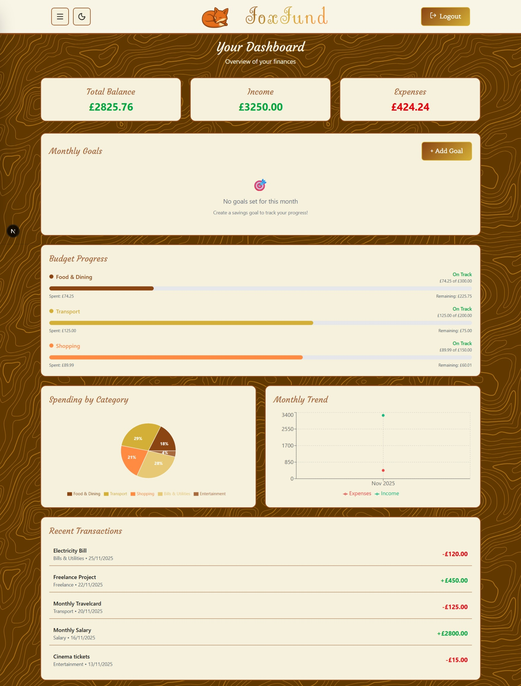 | 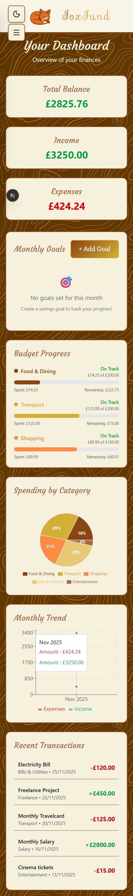 | 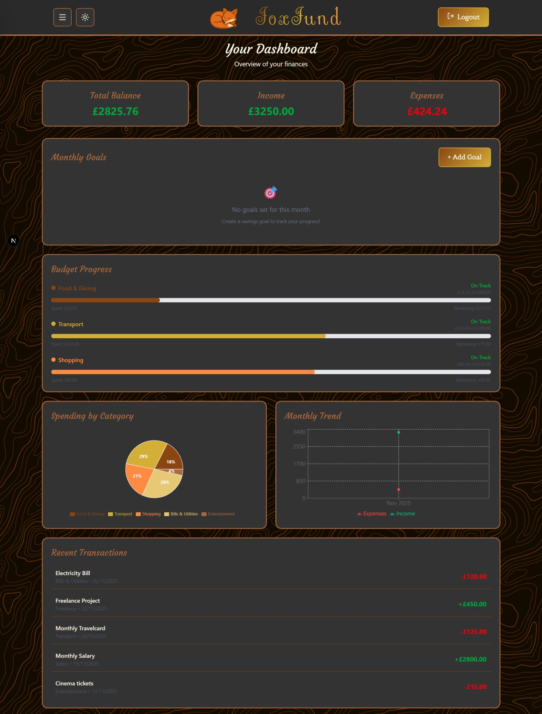 |

### Transactions
| Desktop Transactions | Mobile Transactions | Dark Mode |
|---------------------|---------------------|-----------|
| 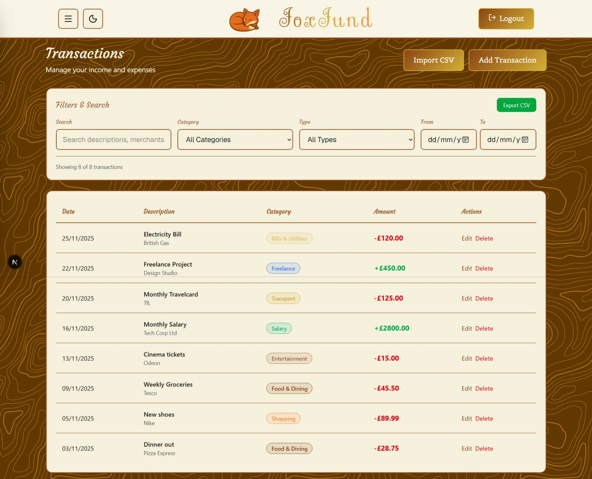 | 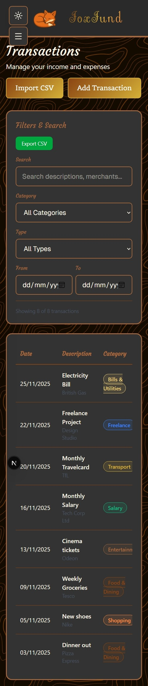 | 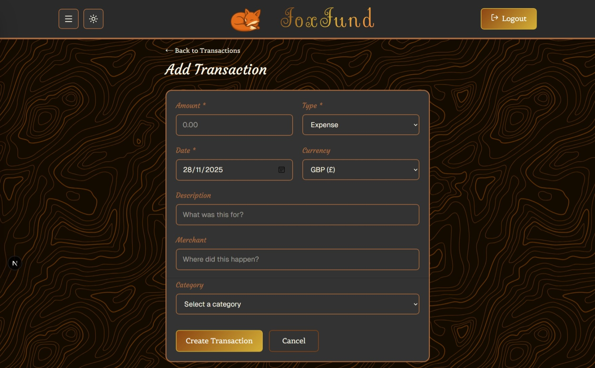 |

### Budget Management
| Desktop Budgets | Mobile Budgets | Shared Budgets |
|-----------------|----------------|----------------|
| 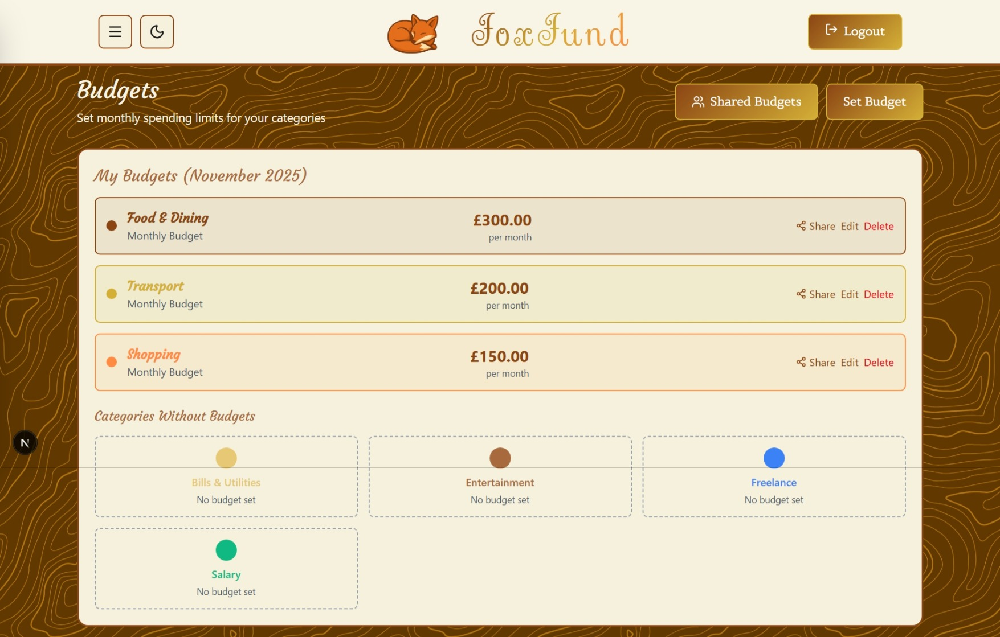 | 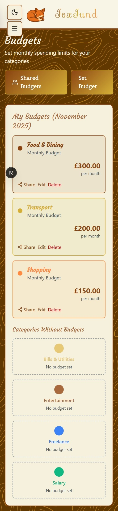 | 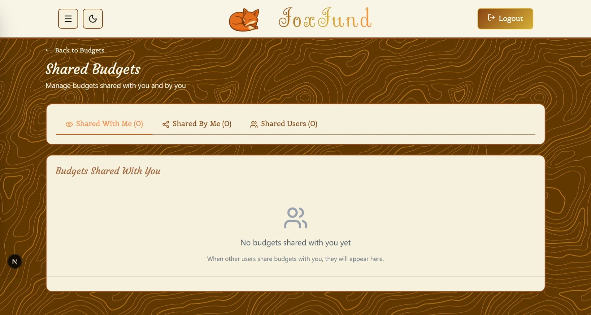 |

### Categories & Goals
| Categories Desktop | Mobile Categories | Savings Goals |
|-------------------|-------------------|---------------|
| 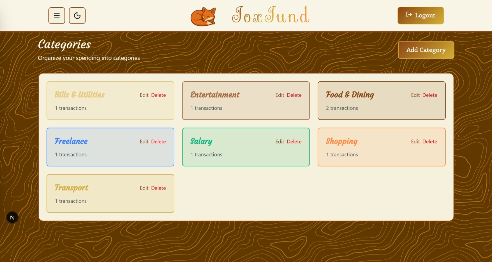 | 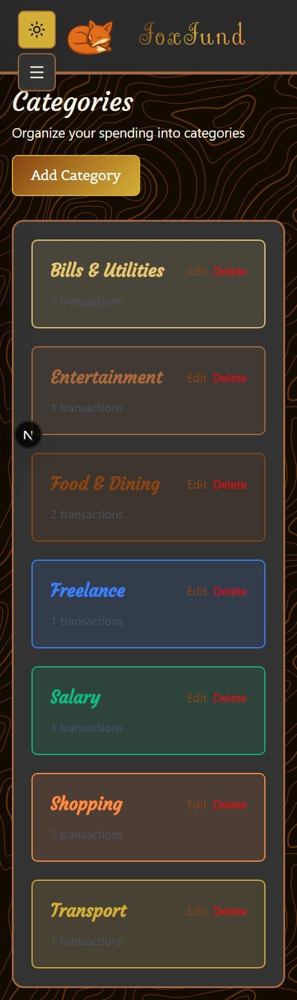 |  |

### User Management
| User Profile | Mobile Profile | Dark Profile |
|--------------|----------------|--------------|
| 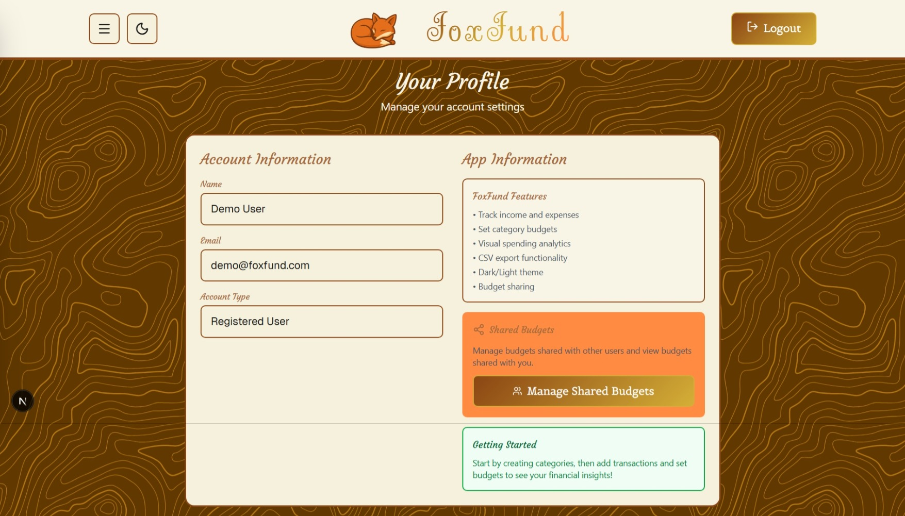 | 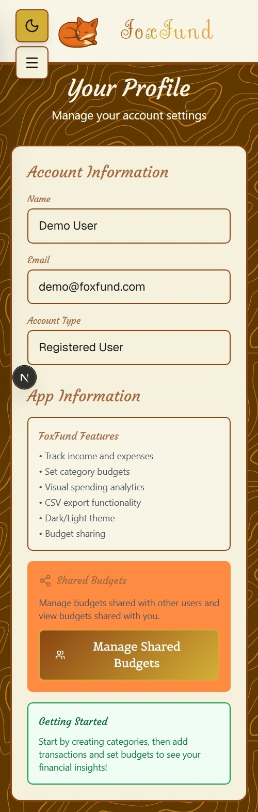 | 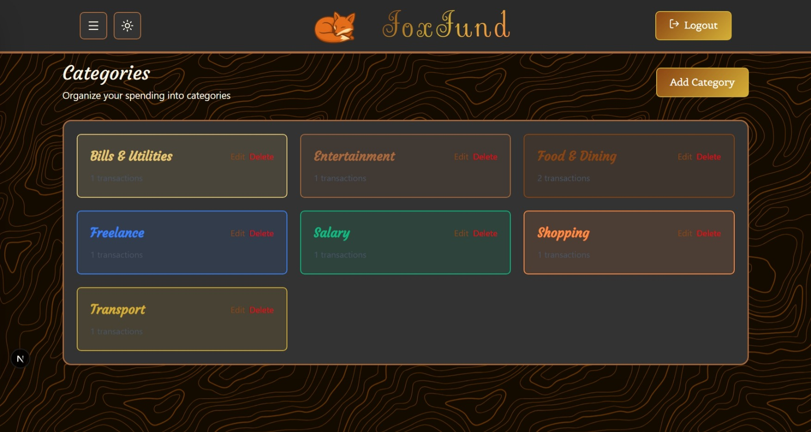 |

## 🏗 Project Structure

foxfund/
├── src/
│ ├── app/ # Next.js App Router pages
│ │ ├── api/ # API routes (auth, transactions, budgets, goals)
│ │ ├── dashboard/ # Main dashboard
│ │ ├── transactions/ # Transaction management
│ │ ├── budgets/ # Budget management
│ │ ├── categories/ # Category management
│ │ └── profile/ # User profile
│ ├── components/ # Reusable React components
│ ├── contexts/ # React context for state management
│ └── lib/ # Utility libraries and services
├── prisma/ # Database schema and migrations
└── public/ # Static assets and screenshots

## 🚀 Getting Started

### Prerequisites
- Node.js 18+
- PostgreSQL database

### Installation
1. Clone the repository
2. Run `npm install` to install dependencies
3. Set up environment variables in `.env.local` file
4. Run `npx prisma generate && npx prisma db push` to set up database
5. Run `npx prisma db seed` to load demo data
6. Run `npm run dev` to start development server

## 📊 Database Schema

The application uses PostgreSQL with the following main models:
- **User** - User accounts and authentication
- **Transaction** - Income and expense records
- **Category** - Spending categories with custom colors
- **Budget** - Monthly budget limits per category
- **Goal** - Monthly savings targets
- **BudgetShare** - Shared budget permissions
- **Notification** - User notifications

## 🔌 API Endpoints

- `POST /api/auth/*` - NextAuth authentication routes
- `GET/POST /api/transactions` - Transaction management
- `GET/POST /api/budgets` - Budget management
- `GET/POST /api/goals` - Savings goals management
- `GET/POST /api/categories` - Category management
- `GET /api/dashboard` - Dashboard data aggregation
- `GET /api/notifications` - User notifications

## 🎯 Deployment

The application is deployed on **Vercel** with a **PostgreSQL** database on **Neon**. The frontend, backend, and database are fully integrated and operational in production.

## 💡 Learning Outcomes

This project demonstrates full-stack TypeScript development with modern technologies including Next.js 15 App Router, Prisma ORM, advanced data visualization, real-time notifications, and complex relational database design.

## 👨‍💻 Developer

This project was developed as part of a full-stack developer portfolio showcasing modern web development skills with TypeScript, Next.js, and PostgreSQL.

---

*FoxFund - Take control of your finances with smart budgeting. 🦊*